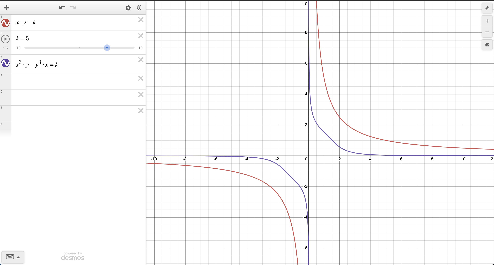

# Protocol Overview

The design of decentralized AMM was initially introduced by Vitalik Buterin in 2016-2017 years and later implemented by Uniswap and Bancor teams for their products. Unlike conservative ways to trade assets like order books, the AMM allows anyone to create a pool containing liquidity of X and Y coins relative to each other (with the same value).

Using that liquidity pool, the users can swap their coins by providing one side asset in exchange for another. In contrast, liquidity providers should provide both X and Y coins to get LP coins in exchange (that coins allow them to earn fees and get back their liquidity later).

To make it possible, AMM usually utilizes **"Constant Function"** that allows the protocol to ensure that the liquidity pool is not draining during any liquidity event. Furthermore, as both coins in a pool are valued relative to each other, we can utilize a simple function introduced by Uniswap v2:

```
x * y = k
```

The abovementioned formula ensures that trades do not change the product `k`. That formula is suitable for uncorrelated swaps and works as expected in most cases, including uncorrelated swaps on Liquidswap.

_For other kinds of swaps like the stable one, the formula is not very effective; this is the main reason stable swaps protocols and LiquidSwap, too (indeed for stable swaps), use a different formula to get it more smooth on large values._

## User Flow

As already mentioned, there are two types of users: liquidity providers and traders.

### Liquidity providers

The liquidity providers create new pools and provide liquidity to them: coin `X` and coin `Y` (we call them so), which traders can exchange, and in return, liquidity providers get LP coins. If liquidity providers want their assets back - they can burn LP coins and get their coin `X` and coin `Y` back together with earned fees.

The LPs can be:

* Traders who want a passive income by utilizing their coins `X` and `Y`.
* Projects creators who want to support their coin with initial liquidity.
* Defi protocols focused on passive income, experimental strategies, etc.

### Traders

Traders execute the pool contract, which contains a swap function call and exchange provided coin `X` or coin `Y` or both using liquidity in a pool. Traders pay fees to liquidity providers for exchange.

_All liquidity operations can be done using_ [_Liquidswap Dapp_](https://liquidswap.com) _or direct calls to deployed smart contracts._

## Fees & Treasury

Currently, Liquidswap extract `0.3%` fees from any value trader who want to exchange (it affects only swap operations).

The `0.2%` of that amount goes to liquidity providers, the rest `0.1%` going to treasury contracts created for each liquidity pool on the protocol.

To get their fees, liquidity providers can burn their LP coins and earn both liquidity and fees in exchange.

The treasury itself is currently planned to be managed by the multisignature of Pontem and trusted 3rd parties (like Pontem investors, solid community members, etc.) and later can be migrated to a full-fledged treasury contract managed by Pontem DAO.

## Stable swaps

Decentralized swaps between stablecoins like USDT, USDC, and DAI have always been a challenge for popular DEXes like Uniswap or SushiSwap because of high slippage – the change in price that occurs as a result of a swap. The problem lies in the standard formula used to calculate the relative prices of two assets in a pool: `x * y = k`, also known as the constant product formula described above.

Without going into too much technical detail, we can say that a single large swap can significantly affect a token’s price, especially when liquidity in the pool is shallow. For stablecoins this is unacceptable, as they should always trade 1:1 (or almost) to each other.

The same goes for pairs like BTC/WBTC and ETH/WETH. They are also called correlated assets, as their relative prices are (or should be) almost ideally correlated.

The solution is to use a different formula for swaps between correlated assets – one that can keep slippage minimal even for large transactions. So far, one of the most successful formulas was proposed by Solidly, a stablecoin DEX on Fantom built by Andre Cronje. It looks like this:

&#x20;`x^3*y + x*y^3 = k`.



By default supports two curves and, in that way, allows for the creation of two types of pools: uncorrelated pairs and stables.

## Emergency stop

As Aptos, Move language and Move VM is very new, and they need time to be verified, checked, and 100% secure. We leave us a way to stop all liquidity minting and swap operations and, simultaneously, allow liquidity providers to burn LP coins.

We hope it will never happen, as we have also done several security audits. Yet, we still want to have that "emergency button," as there can be protocol-level issues, there can be virtual machine-level issues, etc.

That function currently would be managed by the Pontem team and later can be replaced by multisignature.

Once we see the protocol is stable enough and secure, we have an option to disable emergency functions forever.

## Security audits

The current security aduits in progress by [OtterSec](https://osec.io/) and [Halborn](https://halborn.com/) teams.

The reports will be published once it's available.

## Formal verification

Formal verification is an exciting feature of Move language, yet at the same time, it's still a little raw and not very adopted for many cases.

So, covering Liquidswap is a challenge, and it's in progress right now, we are making efforts from time to time, but we hope in the end, it will be covered with formal verification as much as possible.
